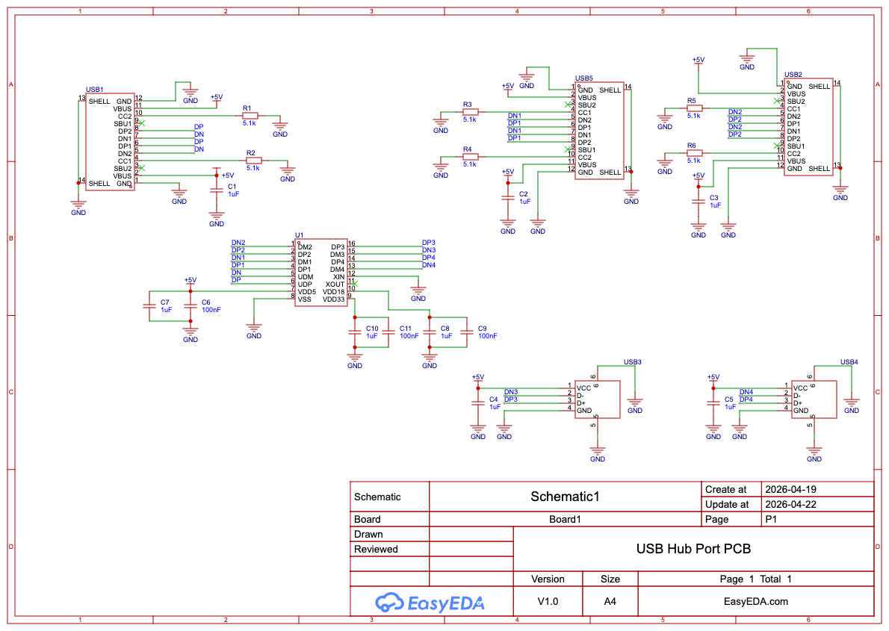
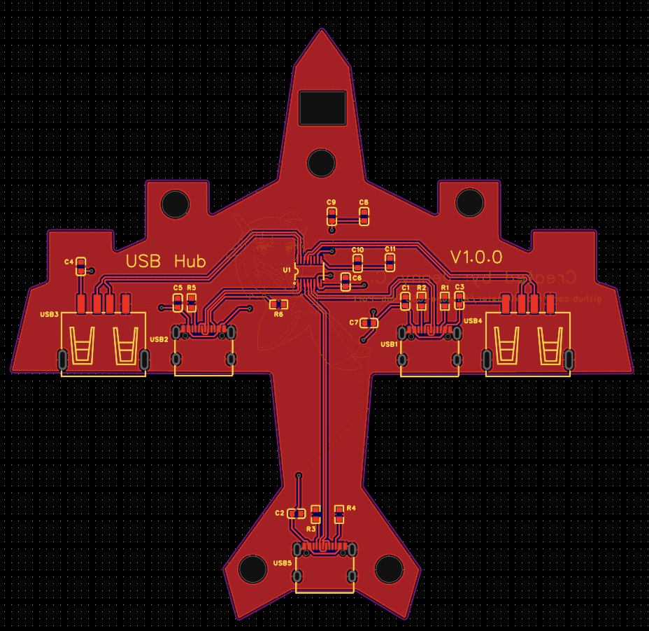
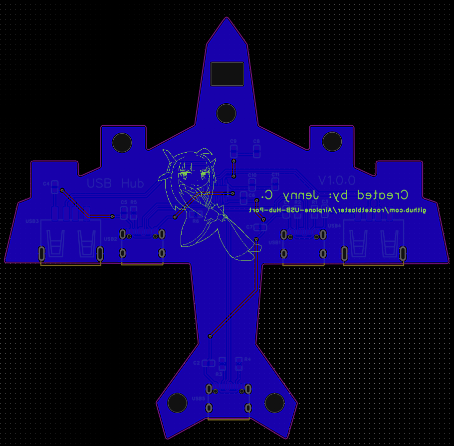

# Airplane-USB-Hub-Port

(Zine)
(render image)

## Description
### What is this?
This is an airplane jetliner shaped USB hub port with the usb connectors as the engines. When you plug in the USB connectors, it makes a trail like shape. On the top layer it has text with my name on it, and the bottom layer contains my own art, name and link to GitHub!

### What does it do?
It can transfer data from one device to another plugged in. If you're me and you have a Macbook, this proves quite useful for wireless mouse, USB drives, perhaps having to connect multiple devices at a time. I don't know who you are but if you're that person to use lots of devices to connect to one computer that's a lot of electronics to connect! Don't worry, this'll prove useful.

Features
- One upstream port by the tail
- 2x Downstream port USB-C
- 2x Downstream port USB-A
- Integrated chip
- My own art!

### Why I made this
The reason why I made this Printed Circuit Board is because I love airplanes and i was inspired when I was googling cute cool aesthetic shaped USB hub ports. There were so many options. I wanted to go for an easier one but challenge is good!

## Schematic

## PCB

### Front

### Back

### Back

## BOM

## Assembly 

This PCB uses SMD components. USB connectors are through hole. Other than that a small soldering iron is recommended to solder on the resistors, capciators and integrated chip.

### Usage

 For the upstream port, you can get a USB-C end on a cable and the other end you can use to plug into the computer!

## Miscelleanous

Inspired by the Fallout USB Hub guide for some parts I needed help with as a reference.

### Time Taken: 16 hours
